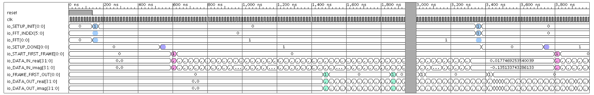

Mixed-Radix FFT Generator
===================

This repository contains the ChiselDSP code used to generate memory-based, (optionally) runtime-reconfigurable, fixed-point, mixed-radix FFTs. For typical FFT sizes (i.e. LTE/Wifi), this generator can create designs that are fully streaming (currently with a calculation clock rate that is 2x the IO clock rate and 1 butterfly, but I should be able to do better with improved scheduling). For a given FFT of size N, only 2N memories are needed to accomplish this via alternating between DIF/DIT. If you need a reconfigurable FFT that supports multiple N, there is some additional memory overhead (~10-20%, depending on radices that must be supported and the particular set of N's). The prime factor algorithm is utilized to more easily partition twiddle ROM and reduce ROM sizes. The WFTA butterfly used is runtime-reconfigurable to support multiple radices and also hardware-optimized depending on the radices needed. Check out the [ICASSP2016--To Be Presented](#) paper for discussion on architecture and algorithm choices and implementation details.

----------

Generator Parameters
===============

See [ChiselDSP Readme](https://github.com/shunshou/ChiselEnvironment/blob/master/README.md) for ChiselDSP-specific JSON parameters. Additionally, the FFT requires the following fields (see [JSON](resources/FFT.json)):

- **fft**
     - **sizes**: Array of desired FFT sizes (must be some multiple of support radices)

- **test**
      - **frames**:  # of frames of length N to run through the tester. Note that the frames consist of a (gaussian) randomly generated N-length sequence that is scaled so that the output will not overflow, for a given *DSPFixed*'s integer and fractional width settings. Additionally, the inputs are trimmed so that the inputs to the FFT in either double-precision floating point mode or fixed-point mode will roughly have the same resolution. The FFT output is compared with the output of the [Breeze](https://github.com/scalanlp/breeze) FFT. The error tolerance when running with the double-precision floating point design is set to be significantly smaller than the magnitude of the smallest expected output. The error tolerance when running with the fixed-point design must be tuned to what is acceptable to you, because of accumulation of quantization error, etc. (Underflow is bad ☹).

> **Note #1**: The list of parameters for tuning the generator will be expanding.
>
> **Note #2**: The generated FFTs have been verified with the Chisel tester and also via Platform-specific simulation tools. The quality (accuracy) of the design can be enhanced with additional fixed-point options, like block floating point. Let me know what works best for you!
>
> **Note #3**: Certain combinations of N's are buggy (the compiler with either crash, or Chisel test will fail). I'm working on cleaning my code up, so hopefully this will get fixed ASAP.
>
> **Note #4**: If you're wondering why the generated Verilog has all these extraneous T### signals that just get passed around, talk to the Chisel Guys ☹.

----------

External Interface
===============

> **Note #1**: Inputs are asserted slightly after the **clk** *rising* edge. The testbench also checks the outputs slightly after the **clk** *rising* edge.
>
> **Note #2**: To clarify jargon, a frame consists of N symbols, where N is the FFT length.

**INPUTS**

- **reset**: Only used for setting default values @ startup.
- **clk**: Calculation clock (currently, the frequency is 2x higher than IO, but this should become parameterizable.)
- **io_SETUP_INIT**: Should go high for 1 IO clock cycle (2 **clk** cycles) to enable runtime reconfiguration at any time. Note that the FFTs currently being calculated will be trashed.
- **io_FFT_INDEX**: This only needs to be valid when **io_SETUP_INIT** is high. The index corresponds to the particular FFT N that you want to currently operate with. The mapping of index to N can be found in the **asic/generator_out.json** or **fpga/generator_out.json** file after running `make asic` or `make fpga` respectively.
- **io_FFT**: High corresponds to FFT; low corresponds to IFFT. *IFFT has not been implemented yet!* This only needs to be valid when **io_SETUP_INIT** is high.
- **io_START_FIRST_FRAME** should be high for only 1 IO clock cycle, any time after detecting that **io_SETUP_DONE** is asserted high by the hardware.
- **io_DATA_IN_real & io_DATA_IN_imag** are the real and imaginary components of the input data (with integer and fractional widths specified by the JSON file). When **io_START_FIRST_FRAME** is high, the input data for *n=0* should be fed in (note that each input symbol is held for 1 IO cycle). The next symbol is fed in at each subsequent IO cycle.

**OUTPUTS**

- **io_SETUP_DONE**: This signal will be continuously high after the hardware has finished setting up with a new FFT/IFFT configuration. Note that 1 IO cycle after **io_SETUP_INIT** goes high, **io_SETUP_DONE** will go low and stay low until the setup is done.
- **io_FRAME_FIRST_OUT**: The hardware will assert this signal high for 1 IO cycle every frame. While **io_FRAME_FIRST_OUT** is high, the first symbol *k=0* is being output.
- **io_DATA_OUT_real & io_DATA_OUT_imag** are the real and imaginary components of the output data (with integer and fractional widths specified by the JSON file). Each output symbol is held for 1 IO cycle. The next symbol is fed in at each subsequent IO cycle.

----------

Detailed Timing Diagram
===============

- FFT/IFFT setup configuration (input, 1 IO clock) is in **blue**.
- Hardware setup done (output, 1 IO clock) is in **purple**.
- First input symbol (input, 1 IO clock) is in **pink**.
- First output symbol of each output frame (output, 1 IO clock) is in **green**. Note that for *N=12*, there are 12 symbols per frame (as indicated by the timing diagram).

> **Note #1**: The output symbols between **io_SETUP_INIT** assertion and the first subsequent **io_FRAME_FIRST_OUT** (following **io_SETUP_DONE** assertion) assertion should not be considered valid.
>
> **Note #2**: Timing diagram was modified from [Xilinx](http://www.xilinx.com) simulator waveform.